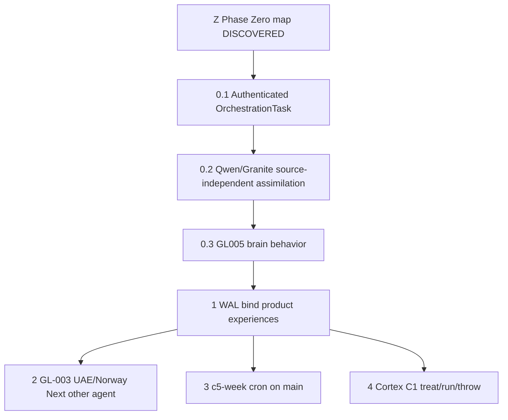

# PHASE ZERO — RAIOS WORLD-CLASS DISCOVERY & EXECUTION MAP

- Decision: `D-061` (DISCOVERED, not CANONICAL). Foundation remains `D-059` / P0 `D-060`.
- HEAD: `d576fac859ed34f9c0be0db6f323d3ecfdf3688d`
- Stamp: `2026-08-21T19:47:45.946214+00:00`
- Runner: `python3 scripts/ai-os/raios_c5_phase0.py`
- `GL005_PROVEN=false` `EXTRACTED_QWEN_GRANITE=false` `SAFE_TO_REMOVE_SOURCE=false`

## What world-class means here

World-class RAIOS is entropy reduction on one live path: product + authenticated orchestration + C5 mind + one Cognitive WAL. It is not a 22-phase archive, not a 90-day empire, and not CI-as-intelligence.

IS:
- `ONE_LIVE_PRODUCT_PATH`
- `ONE_AUTHENTICATED_ORCHESTRATION_PATH`
- `ONE_LEARNING_AUTHORITY_COGNITIVE_WAL`
- `FAIL_CLOSED_EVIDENCE`
- `C5_HYBRID_THEN_SOURCE_INDEPENDENT_ASSIMILATION`
- `THREE_COMPANY_BRAINS_UNDER_GOVERNANCE`
- `ZERO_PAID_API`
- `ENTROPY_REDUCTION_NOT_FOREST_GROWTH`

IS NOT:
- `CI_PASS_AS_INTELLIGENCE`
- `NINETY_DAY_EMPIRE`
- `TWENTY_TWO_PHASE_ARCHIVE_REVIVAL`
- `CLONE_ODOO_CELERP_AG2_LIGHTRAG`
- `LANGCHAIN_OPENAI_CHROMA_FAISS_DIFY`
- `NINETY_THREE_STUDY_STUBS`
- `SECOND_WAL_OR_MCP_TOOL`
- `MILL_MS_AS_LEARNING`
- `SOURCE_DELETION_ON_ASSUMED_ASSIMILATION`
- `PRINTED_PASS_AS_EVIDENCE`

## Locked facts (D-059 still binds)

```text
############################################################
# RAIOS PHASE ZERO — WORLD-CLASS DISCOVERY & EXECUTION MAP
############################################################
HEAD=d576fac859ed
DECISION=D-061
FOUNDATION=D-059
P0=D-060
PHASE_ZERO_MAP_NE_NEW_KERNEL=true
PHASE_ZERO_MAP_NE_GL005=true
CI_PASS_NE_ASSIMILATION=true
CI_PASS_NE_GL005=true
AUTHENTICATED_ORCHESTRATION_TASK=false
GATE1=BLOCKED
EXTRACTED_QWEN_GRANITE=false
GATE2_STOP=SOURCE_PRESENT
SAFE_TO_REMOVE_SOURCE=false
SOURCE_DELETED=false
GL005_PROVEN=false
GATE3=UNREACHED
EGYPT_HTTP=401
UAE_HTTP=404
NORWAY_HTTP=404
GPU=false
STOP=AUTHENTICATED_ORCHESTRATION_TASK
NEXT=AUTHENTICATED_ORCHESTRATION_TASK;THEN_QWEN_GRANITE_ASSIMILATION;THEN_GL005
############################################################
```

## Discovery — live this host

- RAM ~`15.64Gi`. GPU=`false`. `DATABASE_URL`=`false`. `C1_CORTEX_RUN`=false.
- Product Next `:3000`: session authenticated=`False`. GET `/api/tasks`=`500`. POST unauth=`401`. Path=`product` mock=`false`.
- C5 screen `:8765` present in inventory. Live answer = INDEX + file-read + NeuroLingua. Cortex identity `qwen3.6:35b-a3b` is named, not bound.
- Ollama models: `qwen2.5:0.5b`. Student is not the source. `QWEN_GRANITE_SOURCE_PRESENT=false`.
- Transferred packs: `RAIOS-COGNITIVE-BOOT.json`=no, `_raios-qwen-forensics/reports/QWEN36-FORENSIC-CERTIFICATION.json`=no, `_raios-a17-native-cortex/cortex/runtime/MAIN-CORTEX-BINDING.json`=no.

### Three company brains

| Brain | Keepers | Gap | HTTP | Class | Fill here |
|---|---|---|---|---|---|
| `GREENY_LIFE_EGYPT` | 3/3 | closed | `401` | `CAPABILITY_PROTECTED` | no |
| `GREENS_NATURE_UAE` | 1/1 | open | `404` | `CAPABILITY_ABSENT` | no |
| `GREEN_LINES_NORWAY_EU` | 3/3 | open | `404` | `CAPABILITY_ABSENT` | no |

Egypt HTTP 401 = protected capability, not missing. UAE/Norway HTTP 404 = Next route absent (GL-003). Norway Python keepers exist. Do not fill GL-003 from this Cursor slice.

### Live C5 keepers

- `grind` → `scripts/ai-os/raios_c5_grind.py`
- `week` → `scripts/ai-os/raios_c5_week.py`
- `minute` → `scripts/ai-os/raios_c5_minute.py`
- `speak` → `scripts/ai-os/raios_c5_speak.py`
- `experience` → `scripts/ai-os/raios_c5_experience.py`
- `steward` → `scripts/ai-os/raios_c5_steward.py`
- `proof` → `scripts/ai-os/raios_c5_proof.py`
- `qwen` → `scripts/ai-os/raios_c5_qwen.py`
- `kae` → `scripts/ai-os/raios_c5_kae.py`
- `toc` → `scripts/ai-os/raios_c5_toc.py`
- `mind-fill` → `scripts/ai-os/raios_c5_mind_fill.py`
- `whoami` → `scripts/ai-os/raios_c5_whoami.py`
- `foundation` → `scripts/ai-os/raios_c5_foundation.py`
- `p0` → `scripts/ai-os/raios_c5_p0.py`
- `phase0` → `scripts/ai-os/raios_c5_phase0.py`
- `keyboard` → `scripts/ai-os/raios_c5_keyboard.py`
- `screen` → `scripts/ai-os/raios_c5_screen.py`

### Rejected as world-class substitutes

| Claim | Law | Live keeper |
|---|---|---|
| Celerp | `CELERP_NE_LIVE_ERP` | `prisma/schema.prisma + app/api` |
| AG2/AutoGen | `AG2_NE_RAIOS_COUNCIL` | `.ai-os/mcp + council seats` |
| LightRAG | `LIGHTRAG_NE_COGNITIVE_WAL` | `DIGESTS/INDEX + Cognitive WAL + greenlines_brain/graph.py` |
| LangChain/OpenAI/Chroma/FAISS/Dify/Flowise | `HUNT_FREE_NE_PAID_API` | `INDEX + NeuroLingua + mind-fill` |
| 93 study_*.py | `NAMED_SCRIPT_NE_EXISTING_SCRIPT` | `live C5 keepers` |

## Execution map — fail-closed, no skip



### Z `PHASE_ZERO_MAP` — `DONE_DISCOVERED`

inventory + ordered execution; not a new kernel
- Keeper: `python3 scripts/ai-os/raios_c5_phase0.py`

### 0.1 `AUTHENTICATED_ORCHESTRATION_TASK` — `BLOCKED`

live authenticated POST /api/tasks creates visible OrchestrationTask row
- Keeper: `python3 scripts/ai-os/raios_c5_p0.py`
- Requires: `existing DATABASE_URL`; `legitimate login / session authenticated=true`
- Forbids: `mint APP_SESSION_SECRET`; `forge gl_session`; `provision-admin as proof`; `mock/unit-test as proof`
- Flip: `AUTHENTICATED_ORCHESTRATION_TASK=true still GL005_PROVEN=false`

### 0.2 `QWEN_GRANITE_SOURCE_INDEPENDENT_ASSIMILATION` — `FAIL` stop=`SOURCE_PRESENT`

SOURCE_PRESENT → CAPABILITY_EXECUTES → SOURCE_DISABLED_OR_ISOLATED → C5_EXECUTES_SAME_CAPABILITY → RESTART → STILL_EXECUTES → BENCHMARK_PASS
- Keeper: `python3 scripts/ai-os/raios_c5_p0.py`
- Requires: `qwen3.6:35b-a3b loaded`; `granite loaded`; `C5 independent pack after isolate`
- Forbids: `treat qwen2.5:0.5b as source`; `delete weights`; `skip SOURCE_PRESENT`
- Flip: `EXTRACTED_QWEN_GRANITE=true only after full chain`

### 0.3 `GL005` — `UNREACHED`

routing + association + execution + persistence + reuse
- Keeper: `python3 scripts/ai-os/raios_c5_p0.py`
- Requires: `0.1 PASS`; `0.2 PASS`
- Forbids: `PASS_CANDIDATE as GL005_PROVEN`; `this Cursor claiming GL-005`
- Flip: `GL005_PROVEN still requires C1/allowed-agent review`

### 1 `WAL_BIND_PRODUCT_EXPERIENCES` — `FORBIDDEN_UNTIL_P0`

workflow/integrity/task-orchestration → one cognitive event each; no second bus
- Keeper: `existing RAIOS/V9 WAL after P0; A15 lock remains`
- Requires: `0.1`; `0.2`; `0.3 or C1 burst grant`
- Forbids: `second WAL`; `mutate A15 while LOCK-20260818130148 ACTIVE without grant`

### 2 `GL003_UAE_NORWAY_NEXT` — `GAP_OTHER_AGENT`

UAE/Norway Next routes remain open; Python Norway brain already exists
- Keeper: `GL-003 claimed by deepseek-local`
- Forbids: `fill UAE/Norway Next routes from this Cursor slice`

### 3 `SLEEPLESS_CRON_ON_MAIN` — `BLOCKED_NEEDS_C1_MERGE`

c5-week.yml exists on this branch; GitHub cron fires only from default main
- Keeper: `.github/workflows/c5-week.yml`

### 4 `CORTEX_C1_TREAT_RUN_THROW` — `HOLD`

identity qwen3.6:35b-a3b stays; this host HOST_NO_GPU
- Keeper: `python3 scripts/ai-os/raios_c5_qwen.py --cortex`
- Forbids: `executor throw`; `swap to 0.5b identity`

## Required from C1 / Repair (this slice cannot mint)

1. Existing `DATABASE_URL` + legitimate login so `GET /api/auth/session` is `authenticated=true`, then live `POST /api/tasks`.
2. Load cortex `qwen3.6:35b-a3b` and Granite on a capable host. Do not substitute `qwen2.5:0.5b`.
3. After the assimilation chain, C1 re-evaluates `SAFE_TO_REMOVE_SOURCE`. Executor never throws.
4. Merge `c5-week.yml` to default `main` if sleepless cron is wanted.
5. Do not order source deletion or brain downsizing on CI green.

## Stop / next

- `STOP=AUTHENTICATED_ORCHESTRATION_TASK`
- `NEXT=AUTHENTICATED_ORCHESTRATION_TASK;THEN_QWEN_GRANITE_ASSIMILATION;THEN_GL005`
- This map does not close GL-005 and does not authorize deletion.
